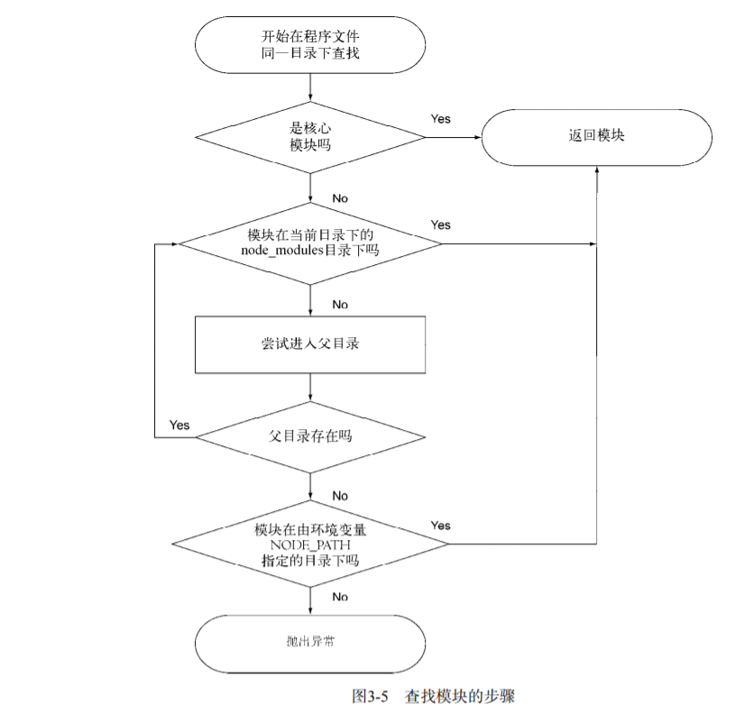

## node 模块化

### exports 和 module.exports 的联系

`exports`本质上是对`module.exports`的全局引用，默认值为一个空的对象`{}`,所以 exports.myFunc 只 是
module.exports.myFunc 的简写。我们使用`exports`都这么用:

```js
exports.a = "a";
//即等价于
module.exports.a = "a";
console.log(module.exports === exports); // true
```

即将变量作为一个属性挂在到默认输出的空对象上。从引用角度而言我们就知道为什么`exports`不允许被重写了。因为其隔断了对`module.exports`的引用。当代码中既有`exports`又有`module.exports`时，`exports`就失效了。

### node_modules 重用模块

在`node`中有一个独特的模块引入机制，可以不必知道模块在文件系统中的具体位置。这个机制就是使用 node_modules 目录。


如果我们引入的模块是目录的话，则目录中定义模块的文件必须制定为`index.js`，除非目录下有`package.json`且`main`属性指定了目标文件。

> node 中没有全局作用域，只有模块作用域

那么既然是模块作用域，模块之间是如何互相通信的？

### node 模块分类

Node.js 的模块分为两类：

-   核心模块（node 提供）
-   文件模块（用户编写）

> 核心模块在 Node.js 源代码编译的时候编译进了二进制执行文件，在 `nodejs` 启动过
> 程中，部分核心模块直接加载进了内存中，所以这部分模块引入时可以省略文件定位和编
> 译执行两个步骤，所以加载的速度最快。另一类文件模块是动态加载的，加载速度比核心
> 模块慢。但是 Node.js 对核心模块和文件模块都进行了缓存，于是在第二次
> `require`时，是不会有重复开销的。其中原生模块都被定义在 `lib` 这个目录下面，文
> 件模块则不定性。
>
> 通过 `process.moduleLoadList` 可以查看已经加载的核心模块。 核心模块 = 原生模块

### 模块引入三步

1. 路径分析
2. 文件定位
3. 编译执行

#### 路径定位

核心模块：如 http、fs、path 等，速度仅次于缓存。路径形式的文件：以.或者..开始的
相对路径，以/开始的绝对路径。自定义模块：不属于核心模块也不属于路径形式的标识符
。它是一种特殊的文件模块，可能是一个文件或者包的形式。这类模块的查找是最费时的，
也是所有方式中最慢的一种。在定位时，会给出一个可能路径的数组。

#### 路径分析代码追踪栈

`Module.prototype.require --> Module._load --> Module._resolveFilename --> Module._resolveLookupPaths --> Module._findPath(文件定位) --> fileName(文件绝对路径)`
几个方法的作用小结： **Module.prototype.require**：直接调用 Module.\_load 并
return **Module.\_load**：调用 Module.\_resolveFilename 获取文件绝对路径，并且根
据该绝对路径添加缓存以及编译模块 **Module.\_resolveFilename**：获取文件绝对路径
**Module.\_resolveLookupPaths**：获取文件可能路径 **Module.\_findPath**：根据文
件可能路径定位文件绝对路径，包括后缀补全（.js, .json, .node）等都在此方法中执行
，最终返回文件绝对路径
